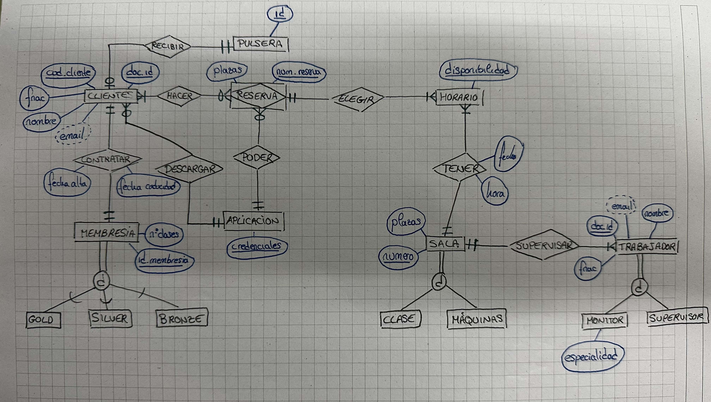
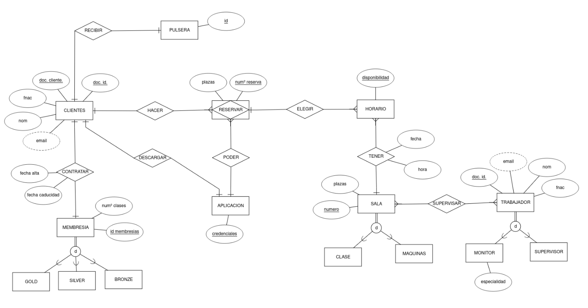

# Documentación proyecto intermodular
**Miembros del grupo**
1. Fernando Rodríguez
   - Fernan1590@gmail.com
2. Juan Sebastián Franco
   - francosebastianjc@gmail.com
4. Akram Allaoui
   - akrall@alu.edu.gva.es
5. Cristian Sanchez
   - criistan11sm@gmail.com
   
## Descripción de la Entidad Relación
Un gimnasio nos ha pedido que realicemos una gestión de su base de datos. Se desea conocer el número de clientes que están inscritos. De cada cliente se quiere conocer el nombre, sus apellidos, su dirección, su documento de identidad, su correo electrónico, su fecha de nacimiento y su número de usuario. Una vez el cliente haya pagado por primera vez una de las tres membresías que posee el gimnasio, las cuales son (Gold, Silver y Bronze), se le entregara una pulsera identificativa con la que podrá acceder al gimnasio, y dentro de él, a las clases dirigidas. 

El usuario también deberá descargarse una aplicación con la cual podrá apuntarse a las clases dirigidas que ofrece el gimnasio. El cliente podrá apuntarse a todas las clases que quiera durante el día, (dependiendo de la membresía que haya pagado) pero nunca podrá apuntarse a dos clases a la misma hora. El gimnasio dispone de varias salas que se utilizan para dar las clases dirigidas. Cada sala puede dar una sola actividad. De cada sala queremos saber su número, la clase que se va a realizar en ella y el aforo máximo de clientes. De las clases dirigidas que se dan en las salas, queremos saber su hora de inicio, la fecha, el nombre del monitor que la da, la sala en la que se realiza, el número de plazas disponible y la duración, y el cliente podrá reservar una clase como máximo hasta 15 minutos antes de que esta empiece y 15 para cancelarla. 

Además de estas salas, también hay una gran sala donde están las máquinas de musculación. Los trabajadores del gimnasio se dividen entre supervisores de sala (que son las personas encargadas de supervisar la sala de máquinas), y los monitores de las clases dirigidas. Son puestos de trabajo diferentes, por lo que uno no puede realizar el trabajo del otro ni al revés.

## Modelo de la Entidad Relación

