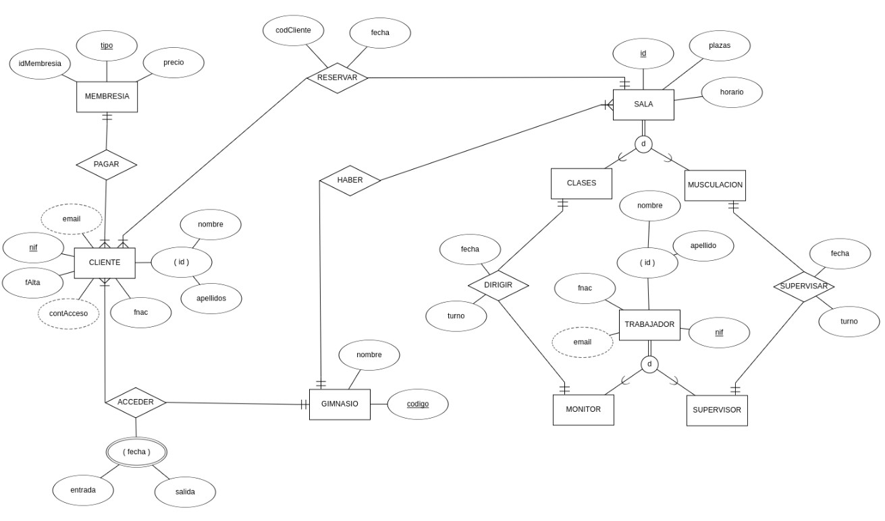

# Documentación proyecto intermodular
## Miembros del grupo
1. Fernando Rodríguez
   - https://github.com/Fernan1590
2. Juan Sebastián Franco
   - https://github.com/ZianFranxes
4. Akram Allaoui
   - https://github.com/akram-allaoui
5. Cristian Sanchez
   - https://github.com/cristian11sm

---

## Indice de los puntos

### 1. Sistema de información (SI)
### 2. Modelo Entidad Relación Extendido (EER)
### 3. Modelo Relacional (MR)
### 4. Diccionario de datos (DD)

---

## 1.  SISTEMA DE INFORMACIÓN
Somos un gimnasio y queremos realizar una gestión de nuestra base de datos. De cada cliente se quiere conocer nombre, apellidos, NIF, correo electrónico y fecha de nacimiento. Nuestros trabajadores se dividen en monitores y supervisores, de los cuales queremos conocer los mismos datos. 

El cliente debe pagar una de las tres membresías que tiene el gimnasio (Gold, Silver y Bronze), cada membresía contiene el número de veces que puede reservar una sala, cada vez que reserve una sala bajará el numero restante y cuando se acaben, deberá pagar de nuevo la membresía u otra (Bronze contiene 10, Silver contiene 20 y Gold contiene 30). Una vez apuntado a una membresía se le iran restando los accesos que realiza al gimnasio. 

El usuario, podrá hacer una reserva (la duración de cada sala reservada es de una hora), como tambien podrá reservar todas las salas que quiera durante la apertura del gimnasio (dependiendo de la membresía que haya pagado) pero nunca podrá dos salas a la misma hora. Se guardará la fecha de reserva y se asociará el código del cliente a la sala durante el tiempo reservado para que pueda entrar. 

Hay dos tipos de salas, de las que se encargan los trabajadores del gimnasio de los que se necesita (email, nif, fnac, id, nombre y apellidos) y tambien queremos saber de cada trabajador la fecha y el turno de trabajo, las de clases dirigidas por monitores en las que imparten zumba, yoga o pilates, y las de musculación, de las cuales queremos saber la cantidad de máquinas que hay, es un estilo de entrenamiento libre. Los supervisores deben de supervisar las máquinas para que se haga un uso correcto de ellas. De cada sala queremos saber el horario y el número de plazas que tiene.

## 2. Modelo de la Entidad Relación

## Justificación

Por una parte, en la entidad *“membresía”* hemos puesto el atributo *“tipo”* porque hay tres membresías distintas, las cuales son: GOLD (30 reservas disponibles), SILVER (20 reservas disponibles), BRONZE (10 reservas disponibles). Con reservas disponibles nos referimos a la cantidad de reservas restantes que le quedan al cliente por hacer, cuando el contador esté en cero, deberá pagar otra vez la misma membresía u otra.
 
Por otra parte, La relación *“haber”* y la entidad *“sala”* las hemos puesto débiles porque el gimnasio puede estar en distintas ciudades, no hay uno solo. Además, las salas pueden ser de clases dirigidas o de musculación al estilo libre, por eso, estas dos últimas las hemos puesto como hijos de sala y con una “d” ya que una sala puede ser o de clases o de musculación, no de las dos a la vez.

Seguido de esto, el atributo *"fecha”* en acceder lo hemos puesto con compuesto y multivaluado porque un cliente puede entrar y salir varias veces un mismo día, por eso, podría tener varios valores 

Por último, más de lo mismo con la entidad *“trabajador”*, tiene como hijos *“monitor”* y *“supervisor”* y de tipo *“d”* también.

---
## 3. Modelo Relacional (MR)

### CLIENTE
- **Atributos**: (<u>nif</u>, email, fAlta, contAcceso, fnac, nombre, apellidos)
- **PK**: (nif)

### MEMBRESIA
- **Atributos**: (<u>tipo</u>, precio, idMembresia, nifCliente*)
- **PK**: (tipo)
- **FK**: (nifCliente) --> CLIENTE
- **VNN**: (nifCliente)

### GIMNASIO
- **Atributos**: (<u>codigo</u>, nombre, nifCliente*)
- **PK**: (codigo)
- **FK**: (nifCliente) --> CLIENTE
- **VNN**: (nifCliente)

### SALA
- **Atributos**: (<u>id</u>, plazas, horario, codigo*, nifCliente*)
- **PK**: (id)
- **FK**: (codigo) --> GIMNASIO
- **FK**: (nifCliente) --> CLIENTE
- **VNN**: (codigo)
- **VNN**: (nifCliente)

### TRABAJADOR
- **Atributos**: (<u>nif</u>, fnac, nombre, apellido, email)
- **PK**: (nif)

### MONITOR
- **Atributos**: (<u>nif*</u>)
- **PK**: (nif)
- **FK**: (nif) --> TRABAJADOR
- **VNN**: (nif)

### SUPERVISOR
- **Atributos**: (<u>nif*</u>)
- **PK**: (nif)
- **FK**: (nif) --> TRABAJADOR
- **VNN**: (nif)

### CLASES
- **Atributos**: (<u>id* </u>, nifMonitor*)
- **PK**: (id)
- **FK**: (id) --> SALA
- **FK**: (nifMonitor) --> MONITOR
- **VNN**: (nifmonitor)

### MUSCULACION
- **Atributos**: (<u>id* </u>, nifSupervisor*)
- **PK**: (id)
- **FK**: (id) --> SALA
- **FK**: (nifSupervisor) --> SUPERVISOR
- **VNN**: (nifSupervisor)
  

---
## 4. Diccionario de Datos (DD)

**CLIENTE**

| Campo       | Tipo de dato   | Descripcion                       |
|-------------|----------------|------------------------------------|
| Nif         | Varchar (32)   | Clave primaria, identificador de cliente |
| Email       | Varchar (128)  | Email de cliente                  |
| fAlta       | Fecha          | Fecha de alta del cliente         |
| contAcceso  | Int            | Contador de acceso                |
| Fnac        | Fecha          | Fecha de nacimiento               |
| Nombre      | Char (32)      | Nombre del cliente                |
| Apellidos   | Char (64)      | Apellidos del cliente             |

**MEMBRESIA**

| Campo       | Tipo de dato   | Descripcion                       |
|-------------|----------------|------------------------------------|
| Tipo        | Char (16)      | Clave primaria, tipo de membresia del cliente |
| Precio      | Int            | Precio de la membresia            |
| idMembresia | Int            | Identificador de la membresia     |
| Nif         | Varchar (32)   | Clave ajena de CLIENTE            |

**GIMNASIO**

| Campo       | Tipo de dato   | Descripcion                       |
|-------------|----------------|------------------------------------|
| Codigo      | Int            | Clave primaria, identificador del gimnasio |
| Nombre      | Varchar (64)   | Nombre del gimnasio               |
| Nif         | Varchar (32)   | Clave ajena CLIENTE               |

**SALA**

| Campo       | Tipo de dato   | Descripcion                       |
|-------------|----------------|------------------------------------|
| Id          | Int            | Identificador de la sala          |
| Plazas      | Int            | Numero de plazas                  |
| Horario     | Fecha          | Horario de la sala                |
| Codigo      | Int            | Clave ajena de GIMNASIO           |
| Nif         | Varchar (32)   | Clave ajena de CLIENTE            |

**TRABAJADOR**

| Campo       | Tipo de dato   | Descripcion                       |
|-------------|----------------|------------------------------------|
| Nif         | Varchar (32)   | Clave primaria y nif del trabajador |
| Fnac        | Fecha          | Fecha de nacimiento del trabajador |
| Nombre      | Char (32)      | Nombre del trabajador             |
| Apellido    | Char (64)      | Apellidos del trabajador          |
| Email       | Varchar (128)  | Email del trabajador              |

**MONITOR**

| Campo       | Tipo de dato   | Descripcion                       |
|-------------|----------------|------------------------------------|
| Nif         | Varchar (32)   | Clave primaria y ajena de TRABAJADOR |
| Fnac        | Fecha          | Fecha de nacimiento               |
| Nombre      | Char (32)      | Nombre del monitor                |
| Apellido    | Char (64)      | Apellido del monitor              |
| Email       | Varchar (128)  | Email del monitor                 |

**SUPERVISOR**

| Campo       | Tipo de dato   | Descripcion                       |
|-------------|----------------|------------------------------------|
| Nif         | Varchar (32)   | Clave primaria y ajena de TRABAJADOR |
| Fnac        | Fecha          | Fecha de nacimiento               |
| Nombre      | Char (32)      | Nombre del supervisor             |
| Apellido    | Char (64)      | Apellido del supervisor           |
| Email       | Varchar (128)  | Email del supervisor              |

**CLASES**

| Campo       | Tipo de dato   | Descripcion                       |
|-------------|----------------|------------------------------------|
| Id          | Int            | Clave primaria y ajena de SALA    |
| Plazas      | Int            | Numero de plazas                  |
| Horario     | Fecha          | Horario de la sala                |
| Nif         | Varchar (32)   | Clave ajena de MONITOR            |

**MUSCULACION**

| Campo       | Tipo de dato   | Descripcion                       |
|-------------|----------------|------------------------------------|
| Id          | Int            | Clave primaria y ajena de SALA    |
| Plazas      | Int            | Numero de plazas                  |
| Horario     | Fecha          | Horario de la sala                |
| Nif         | Varchar (32)   | Clave ajena de SUPERVISOR         |

---
## Relacion y Restricciones del Diccionario de Datos

**CLIENTE**
- Clave primaria en CLIENTE: `Nif`

**MEMBRESIA**
- Clave primaria en MEMBRESIA: `Tipo`
- Clave ajena en MEMBRESIA: `Nif`, referencia a `Nif` en la tabla CLIENTE, indicando la relacion entre una membresia y su cliente.
- Restriccion de borrado: rechazar.
- Restriccion de modificacion: propagar.

**GIMNASIO**
- Clave primaria en GIMNASIO: `Codigo`
- Clave ajena en GIMNASIO: `Nif`, referencia a `Nif` en la tabla CLIENTE, indicando la relacion entre un gimnasio y su cliente.
- Restriccion de borrado: rechazar.
- Restriccion de modificacion: propagar.

**SALA**
- Clave primaria en SALA: `Id`
- Clave ajena en SALA: `Codigo`, referencia a `Codigo` en la tabla GIMNASIO, indicando la relacion entre una sala y su gimnasio.
- Clave ajena en SALA: `Nif`, referencia a `Nif` en la tabla CLIENTE, indicando la relacion entre una sala y el cliente.
- Restriccion de borrado: rechazar.
- Restriccion de modificacion: propagar.

**TRABAJADOR**
- Clave primaria en TRABAJADOR: `Nif`

**MONITOR**
- Clave primaria en MONITOR: `Nif`
- Clave ajena en MONITOR: `Nif`, referencia a `Nif` en la tabla TRABAJADOR, indicando la relacion entre un monitor y un trabajador.
- Restriccion de borrado: rechazar.
- Restriccion de modificacion: propagar.

**SUPERVISOR**
- Clave primaria en SUPERVISOR: `Nif`
- Clave ajena en SUPERVISOR: `Nif`, referencia a `Nif` en la tabla TRABAJADOR, indicando la relacion entre un supervisor y un trabajador.
- Restriccion de borrado: rechazar.
- Restriccion de modificacion: propagar.

**CLASES**
- Clave primaria en CLASES: `Id`
- Clave ajena en CLASES: `Id`, referencia a `Id` en la tabla SALA, indicando la relacion entre una clase y una sala.
- Clave ajena en CLASES: `Nif`, referencia a `Nif` en la tabla MONITOR, indicando la relacion entre una clase y un monitor.
- Restriccion de borrado: rechazar.
- Restriccion de modificacion: propagar.

**MUSCULACION**
- Clave primaria en MUSCULACION: `Id`
- Clave ajena en MUSCULACION: `Id`, referencia a `Id` en la tabla SALA, indicando la relacion entre musculacion y una sala.
- Clave ajena en MUSCULACION: `Nif`, referencia a `Nif` en la tabla SUPERVISOR, indicando la relacion entre musculacion y un supervisor.
- Restriccion de borrado: rechazar.
- Restriccion de modificacion: propagar.

## MODELO DDL Y DML
1. Fernando Rodríguez
   - Sentencias DDL
2. Juan Sebastián Franco
   - Sentencias DML
3. Cristian Sanchez
   - Vaciado de tablas
